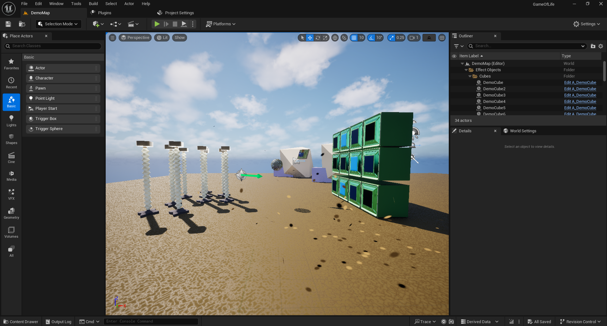
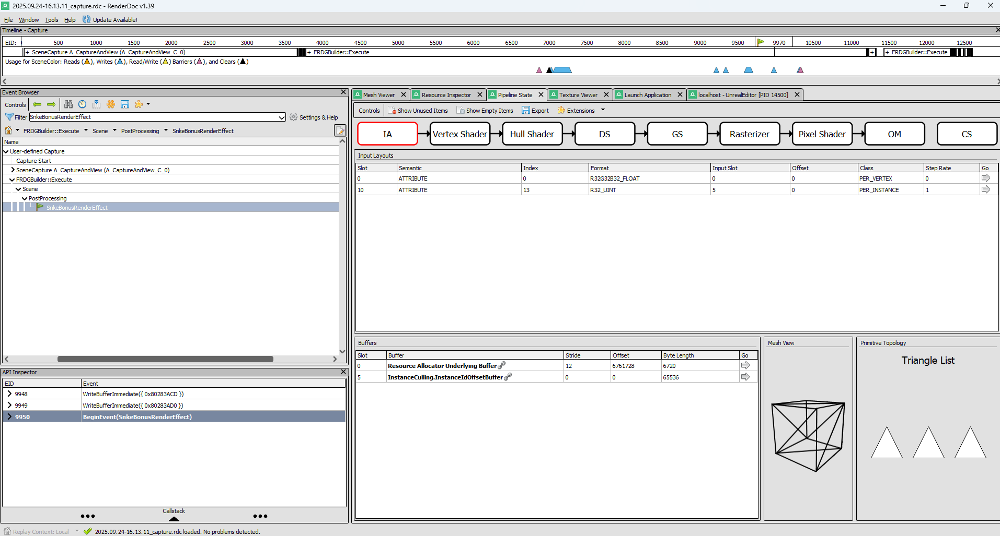

# Unreal Game of Life Render Plugin

This plugin implements a real-time **screen-space Game of Life** simulation that interacts with scene geometry in Unreal Engine. The effect works on static meshes, skeletal meshes, and Niagara particles, letting objects draw into the cellular automata simulation using their own Materials.

## How it works
- **Initialize pass**: sets up the simulation texture  
- **Mesh pass**: scene primitives draw into the simulation, controlled by their Materials  
- **Simulate pass**: a compute shader updates the Game of Life rules each frame  
- **Display pass**: a pixel shader composites the simulation back to screen  
- **Resample pass**: keeps state consistent across resolution changes  

All passes are driven by Unreal’s **Material graph integration** and **mesh/material pass system**, enabling artists to control participation and parameters directly through Materials rather than hard-coded C++.

